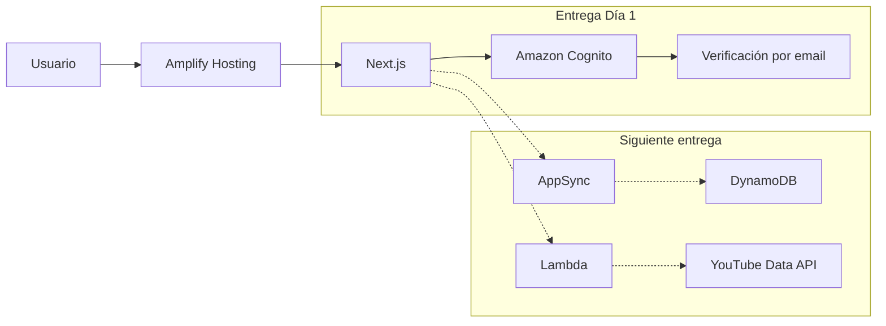

# InnovaTube

[](https://github.com/IsmaelPrado/innovatube-reto/actions/workflows/ci.yml)

Aplicación web para descubrir videos de YouTube y administrar una colección personal de favoritos.

## Estado

Entrega del Día 1:

- Next.js 15, React 19 y TypeScript configurados.
- Backend Amplify Gen 2 desplegado en un sandbox de `us-east-1`.
- Cognito configurado con registro público, verificación por correo y recuperación de contraseña.
- Inicio de sesión mediante username o email verificado.
- Registro, confirmación, reenvío de código, login, logout y recuperación en dos pasos.
- Interfaz responsive con validación accesible y estados de carga/error.
- CI y build specification de Amplify Hosting.

La búsqueda de YouTube, favoritos y reCAPTCHA forman parte de las siguientes entregas.

## Arquitectura



El código de infraestructura está en [`amplify/`](./amplify). Amplify genera `amplify_outputs.json` por entorno para conectar el frontend con los recursos correctos; ese archivo no se versiona.

## Decisiones técnicas

### Next.js y Amplify Gen 2

El plazo del ejercicio es de 72 horas. Una arquitectura serverless permite concentrar el trabajo en autenticación, seguridad, experiencia de usuario y pruebas sin operar contenedores, balanceadores o servidores permanentes.

Next.js 15 se fijó explícitamente porque es una versión soportada por Amplify Hosting. Node.js 22 es la versión objetivo de desarrollo y CI.

### Username y email

La configuración de alto nivel de Amplify usa email como identificador. El reto pide iniciar sesión con username o email, por lo que [`amplify/backend.ts`](./amplify/backend.ts) personaliza el User Pool:

- username inmutable y case-insensitive como identificador principal;
- email requerido, verificado automáticamente y configurado como alias;
- `given_name` y `family_name` requeridos;
- recuperación exclusivamente mediante email verificado.

Esta elección se aplica al crear Cognito porque sus atributos de acceso no pueden modificarse después.

### Seguridad

- Las contraseñas nunca se almacenan ni procesan en una base de datos de la aplicación.
- Cognito aplica mínimo 8 caracteres, mayúscula, minúscula, número y símbolo.
- Los errores de Cognito se traducen sin exponer mensajes internos.
- `amplify_outputs.json`, variables locales, builds y logs están excluidos de Git.
- Los secretos de YouTube y reCAPTCHA se almacenarán con Amplify Secrets, no en el navegador.

## Estructura

```text
amplify/
  auth/resource.ts        Configuración declarativa de Cognito
  backend.ts              Backend y overrides de bajo nivel
src/
  app/                    Rutas y pantallas de Next.js
  components/auth/        Componentes compartidos de autenticación
  lib/                    Validación, errores y pruebas unitarias
.github/workflows/ci.yml  Pipeline de calidad
amplify.yml               Build fullstack de Amplify Hosting
```

## Desarrollo local

Requisitos:

- Node.js 22
- npm 10 o superior
- AWS CLI con un perfil autorizado para Amplify Gen 2

Instala dependencias:

```bash
npm ci
```

Despliega o actualiza tu sandbox y genera `amplify_outputs.json`:

```bash
npx ampx sandbox --profile ismadev
```

En otra terminal inicia Next.js:

```bash
npm run dev
```

La aplicación estará disponible en `http://localhost:3000`.

Para una sola actualización sin modo watch:

```bash
npx ampx sandbox --once --profile ismadev
```

## Calidad

```bash
npm run lint
npm run typecheck
npm test
npm run build
```

`npm run check` ejecuta tipos, pruebas y build en secuencia. GitHub Actions ejecuta además lint en cada push y pull request contra `main`.

## Despliegue

El archivo [`amplify.yml`](./amplify.yml) define el despliegue fullstack:

1. Instala dependencias de forma reproducible con `npm ci`.
2. Despliega el backend de la rama con `ampx pipeline-deploy`.
3. Genera automáticamente el `amplify_outputs.json` de esa rama.
4. Construye Next.js y publica el artefacto `.next`.

Para crear el primer hosting, conecta la rama `main` de este repositorio en Amplify Console. Los siguientes pushes desplegarán frontend y backend automáticamente.

## Alcance siguiente

- Lambda autenticada para consultar YouTube sin exponer la API key.
- Búsqueda con paginación y filtros.
- Modelo `Favorite` con autorización por propietario.
- Vista de favoritos y prevención de duplicados.
- Verificación server-side de reCAPTCHA durante el pre-signup.
- Logs estructurados y pruebas de los flujos principales.
