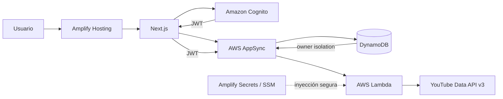

# InnovaTube

[](https://github.com/IsmaelPrado/innovatube-reto/actions/workflows/ci.yml)

Aplicación web fullstack para descubrir videos de YouTube y administrar una colección personal de favoritos.

**Aplicación desplegada:** [main.d1gqu7q6u0ec4d.amplifyapp.com](https://main.d1gqu7q6u0ec4d.amplifyapp.com/login)

## Estado de la entrega

### Día 1: identidad y despliegue

- Next.js 15, React 19, TypeScript y Amplify Gen 2.
- Cognito con registro público, confirmación por email y recuperación de contraseña.
- Login mediante username o email verificado y cierre de sesión.
- Amplify Hosting conectado a `main` con despliegue fullstack automático.
- CI con lint, tipos, pruebas y build de producción.

### Día 2: búsqueda y favoritos

- Consulta GraphQL autenticada que invoca una función Lambda.
- Integración server-side con YouTube Data API v3; la API key nunca llega al navegador.
- Búsqueda con orden, duración, paginación nativa, conteo de vistas y detección de transmisiones en vivo.
- Reproductor embebido con dominio de privacidad mejorada y enlace al video original.
- Modelo `Favorite` persistido en DynamoDB y protegido con autorización por propietario.
- Alta y baja de favoritos sin recargar la página, prevención de duplicados y colección con filtro local.
- Navegación responsive, estados de carga, vacío y error, y logs estructurados en Lambda.
- 18 pruebas unitarias distribuidas en 6 archivos.

El código del Día 2 está completo y validado localmente. Su publicación requiere configurar `YOUTUBE_API_KEY` como secreto tanto en el sandbox como en la rama de Amplify Hosting.

## Arquitectura



Flujo de búsqueda:

1. El usuario autenticado envía términos y filtros desde Next.js.
2. AppSync valida el JWT de Cognito y resuelve `searchVideos` mediante Lambda.
3. Lambda valida la entrada y consulta `search.list` de YouTube.
4. Una segunda consulta a `videos.list` completa duración y vistas en un solo lote.
5. El frontend recibe datos normalizados y tokens opacos para avanzar o retroceder.

Flujo de favoritos:

1. Amplify Data envía las mutaciones autenticadas a AppSync.
2. La regla `allow.owner()` limita lectura, creación y eliminación al propietario.
3. El identificador `<cognito-sub>:<youtube-video-id>` evita duplicados por usuario.
4. DynamoDB persiste metadatos suficientes para mostrar la colección sin consumir cuota de YouTube.

## Decisiones técnicas

### Next.js y Amplify Gen 2

El ejercicio tiene una ventana de 72 horas. La arquitectura serverless concentra el trabajo en la experiencia, seguridad y calidad sin operar contenedores, balanceadores o servidores permanentes. Next.js 15 está fijado explícitamente porque es una versión compatible con Amplify Hosting; Node.js 22 es la versión objetivo de desarrollo y CI.

### Integración con YouTube

La API no se consume directamente desde el navegador. Una consulta GraphQL autenticada invoca Lambda, que obtiene la clave mediante `secret("YOUTUBE_API_KEY")`. Esto evita exponerla en bundles, peticiones del cliente o variables públicas.

Se conservan los tokens de página de YouTube en lugar de inventar paginación por número. La entrada se limita a 2-120 caracteres, los filtros usan enums y los tokens tienen validación de formato. Cada página solicita 12 resultados para mantener una cuadrícula útil sin agotar cuota innecesariamente.

### Persistencia y autorización

`Favorite` usa autorización por propietario de Amplify Data. El cliente no puede consultar favoritos ajenos aunque modifique manualmente una operación GraphQL. Los IDs deterministas eliminan duplicados sin una consulta previa vulnerable a condiciones de carrera.

### Seguridad y privacidad

- Cognito administra contraseñas, verificación y tokens; la aplicación no almacena contraseñas.
- La API key reside en Amplify Secrets, respaldado por SSM Parameter Store.
- La búsqueda exige un JWT válido y el modelo aplica aislamiento por propietario.
- Los errores externos se traducen a mensajes controlados sin filtrar respuestas de YouTube.
- Los logs no incluyen términos de búsqueda, tokens de página, credenciales ni datos personales.
- El reproductor usa `youtube-nocookie.com` y no se carga hasta que el usuario lo abre.
- `amplify_outputs.json`, archivos de entorno, builds y logs están excluidos de Git.

## Estructura

```text
amplify/
  auth/resource.ts                  Cognito
  data/resource.ts                  AppSync, DynamoDB y contrato GraphQL
  data/search-videos/handler.ts     Handler y observabilidad
  data/search-videos/youtube.ts     Cliente y normalización de YouTube
  backend.ts                        Composición del backend
src/
  app/videos/                       Búsqueda, filtros y paginación
  app/favoritos/                    Colección privada
  components/video/                 Tarjeta y reproductor compartidos
  hooks/use-favorites.ts            Estado de favoritos
  services/favorites.ts             Acceso tipado a Amplify Data
  lib/                              Clientes, errores y validación
.github/workflows/ci.yml            Pipeline de calidad
amplify.yml                         Despliegue fullstack
```

## Desarrollo local

Requisitos:

- Node.js 22
- npm 10 o superior
- AWS CLI con un perfil autorizado para Amplify Gen 2
- Una API key con YouTube Data API v3 habilitada

Instala dependencias y registra el secreto del sandbox:

```bash
npm ci
npx ampx sandbox secret set YOUTUBE_API_KEY --profile ismadev
```

Despliega el backend y genera `amplify_outputs.json`:

```bash
npx ampx sandbox --once --profile ismadev
```

Inicia Next.js:

```bash
npm run dev
```

La aplicación estará disponible en `http://localhost:3000`.

## Calidad

```bash
npm run lint
npm run typecheck
npm test
npm run build
```

`npm run check` ejecuta tipos, pruebas y build en secuencia. GitHub Actions ejecuta además lint para cada push y pull request contra `main`.

Las pruebas cubren validación de entrada, construcción de consultas a YouTube, normalización de respuestas, errores de cuota y red, IDs de favoritos, transformación de datos e interacciones de las tarjetas.

## Despliegue

El archivo [`amplify.yml`](./amplify.yml) instala dependencias de forma reproducible, ejecuta `ampx pipeline-deploy`, genera la configuración de la rama, compila Next.js y publica `.next`.

Antes de publicar por primera vez el Día 2, agrega `YOUTUBE_API_KEY` en **Amplify Console > Hosting > Secrets** y asígnalo a la rama `main` o a todas las ramas. Los secretos de sandbox son independientes y no aparecen en Amplify Console.

Después, un push a `main` despliega backend y frontend de forma automática:

```bash
git push origin main
```

## Plan de 72 horas

- **Día 1, completo:** base del repositorio, autenticación integral, CI y primer despliegue.
- **Día 2, código completo:** búsqueda segura de YouTube, AppSync/Lambda, favoritos privados, UI responsive, pruebas y documentación.
- **Día 3:** reCAPTCHA validado server-side durante el registro, endurecimiento, pruebas de aceptación, monitoreo y documentación final.
