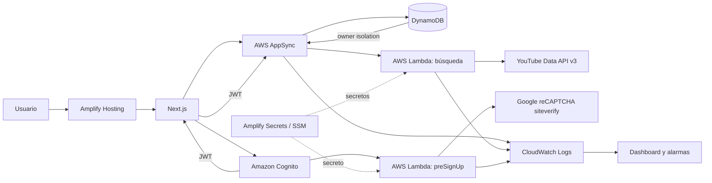

# InnovaTube

[](https://github.com/IsmaelPrado/innovatube-reto/actions/workflows/ci.yml)

Aplicación web fullstack para descubrir videos de YouTube y administrar una colección privada de favoritos.

**Aplicación desplegada:** [main.d1gqu7q6u0ec4d.amplifyapp.com](https://main.d1gqu7q6u0ec4d.amplifyapp.com/login)

## Cobertura del reto

| Requisito | Implementación | Estado |
| --- | --- | --- |
| Registro público | Nombre, apellido, username, email, contraseña y confirmación | Completo |
| reCAPTCHA | v3 por score y validación server-side en un trigger `preSignUp` de Cognito | Completo |
| Inicio de sesión | Username o email verificado, contraseña y logout | Completo |
| Recuperación | Solicitud y confirmación de nueva contraseña mediante Cognito | Completo |
| Videos | Búsqueda, orden, duración, reproducción y carga incremental | Completo |
| Favoritos | Alta, listado con búsqueda y baja, aislados por propietario | Completo |
| Navegación | Usuario autenticado, sidebar responsive, perfil y logout | Completo |
| Biblioteca UI | Amplify UI para loaders y estados; Lucide para iconografía | Completo |
| Seguridad adicional | JWT, secretos server-side, autorización owner y CAPTCHA | Completo |
| Diseño responsivo | Desktop, tablet y navegación móvil | Completo |
| Monitoreo y logging | Logs privados, dashboard y alarmas de CloudWatch | Completo |
| Contenedores | No se usan: era un plus, no un requisito | No aplica |
| Repositorio y despliegue | GitHub, CI y Amplify Hosting fullstack | Completo |

Los logs operativos no se muestran en la UI porque pueden revelar detalles internos y no son útiles para un usuario final. La aplicación presenta estados seguros de carga, vacío, error y reintento; CloudWatch conserva los eventos técnicos para operación y diagnóstico.

## Entrega por día

### Día 1: identidad y despliegue

- Next.js 15, React 19, TypeScript y Amplify Gen 2.
- Cognito con registro, confirmación por email y recuperación de contraseña.
- Login mediante username o email verificado y cierre de sesión.
- Amplify Hosting conectado a `main` y CI con lint, tipos, pruebas y build.

### Día 2: búsqueda y favoritos

- Consulta GraphQL autenticada que invoca una función Lambda.
- Integración server-side con YouTube Data API v3; la API key nunca llega al navegador.
- Búsqueda por texto, orden y duración, con datos de duración, vistas y transmisiones en vivo.
- Reproductor con dominio de privacidad mejorada.
- Modelo `Favorite` en DynamoDB con autorización por propietario y prevención de duplicados.
- Alta y baja de favoritos sin recargar, colección privada y filtro local.

### Día 3: endurecimiento y operación

- Scroll infinito con tokens nativos de YouTube, deduplicación y protección contra ciclos.
- Skeletons para sesión de Cognito, carga inicial de videos, favoritos y páginas incrementales.
- reCAPTCHA v3 ejecutado al enviar y validado obligatoriamente dentro de Cognito.
- Logs de AppSync y Lambdas sin tokens, búsquedas, credenciales ni datos personales.
- Dashboard y alarmas para errores, throttling y latencia p95 de la búsqueda.
- Pruebas de aceptación para autenticación, scroll, favoritos, tema, móvil y registro protegido.
- Documentación final de arquitectura, seguridad, despliegue y decisiones.

## Arquitectura



Flujo de búsqueda:

1. AppSync valida el JWT y resuelve `searchVideos` mediante Lambda.
2. Lambda valida la entrada y consulta `search.list` de YouTube.
3. Una consulta a `videos.list` completa duración y vistas en un solo lote.
4. El frontend conserva resultados, deduplica IDs y solicita el siguiente token cerca del final del scroll.

Flujo de registro:

1. Al enviar el formulario, el navegador ejecuta la acción v3 `signup` y envía el token como `clientMetadata` a Cognito.
2. Cognito invoca `preSignUp`; la Lambda verifica el token directamente con Google.
3. Se comprueban `success`, hostname, `action=signup` y un score mínimo de `0.5`.
4. Ante ausencia, expiración, timeout o rechazo, el registro falla cerrado.

Flujo de favoritos:

1. Amplify Data envía operaciones autenticadas a AppSync.
2. `allow.owner()` limita lectura, creación y eliminación al propietario del registro.
3. El ID `<cognito-sub>:<youtube-video-id>` hace idempotente el alta por usuario y video.

## Decisiones técnicas

### Next.js y Amplify Gen 2

El reto permite elegir tecnología y sólo recomienda Angular y Node.js. Next.js y Amplify Gen 2 aprovechan la experiencia existente, reducen riesgo dentro de 72 horas y eliminan la operación de ECS, balanceadores e imágenes. El backend sigue siendo Node.js administrado en Lambdas, con infraestructura tipada y reproducible.

No se agregaron contenedores porque son un plus y no aportan una ventaja para estas cargas event-driven. ECS tendría más costo, configuración y superficie operativa sin mejorar los requisitos evaluados.

### Biblioteca y experiencia UI

El proyecto ya usa `@aws-amplify/ui-react`; sus loaders se integran con skeletons propios que respetan el diseño. Lucide aporta iconos accesibles. Agregar Tailwind sólo para declarar otra biblioteca duplicaría el sistema de estilos y aumentaría el cambio sin valor funcional.

La paginación visible se sustituyó por `IntersectionObserver`. Se solicitan 12 elementos por llamada, se conserva el contenido existente durante la siguiente carga y se muestra un skeleton incremental. Un fallo mantiene los resultados y ofrece reintento, en lugar de vaciar toda la pantalla.

### Seguridad y privacidad

- Cognito administra hashes de contraseña, verificación, expiración y renovación de tokens.
- AppSync exige JWT y DynamoDB queda detrás de autorización por propietario.
- `YOUTUBE_API_KEY` y `GOOGLE_RECAPTCHA_SECRET_KEY` se resuelven desde Amplify Secrets.
- La clave pública de reCAPTCHA es la única variable `NEXT_PUBLIC_*`; el secreto nunca se compila en Next.js.
- El trigger `preSignUp` impide omitir CAPTCHA llamando Cognito directamente.
- Los errores externos se traducen a mensajes controlados.
- AppSync excluye contenido verbose y registra sólo errores durante un mes.
- Los logs estructurados omiten PII, términos de búsqueda, tokens de página y respuestas CAPTCHA.
- El identity pool no permite identidades anónimas.
- El reproductor usa `youtube-nocookie.com` y se crea sólo cuando el usuario lo abre.

## Estructura

```text
amplify/
  auth/pre-sign-up/                 Trigger y verificación reCAPTCHA
  auth/resource.ts                  Cognito
  data/search-videos/               Lambda y cliente de YouTube
  data/resource.ts                  AppSync, logging, DynamoDB y GraphQL
  backend.ts                        Backend, dashboard y alarmas
src/
  app/videos/                       Búsqueda y scroll infinito
  app/favoritos/                    Colección privada
  components/auth/                  Flujos e integración reCAPTCHA v3
  components/video/                 Tarjetas, reproductor y skeletons
  hooks/ y services/                Estado y acceso tipado a Amplify
tests/e2e/                          Aceptación con Playwright
.github/workflows/                  CI y aceptación manual
```

## Desarrollo local

Requisitos: Node.js 22, npm 10 o superior, AWS CLI, un perfil autorizado y claves para YouTube Data API v3 y reCAPTCHA v3.

```bash
npm ci
npx ampx sandbox secret set YOUTUBE_API_KEY --profile ismadev
npx ampx sandbox secret set GOOGLE_RECAPTCHA_SECRET_KEY --profile ismadev
cp .env.example .env.local
```

Asigna la clave pública de reCAPTCHA a `NEXT_PUBLIC_RECAPTCHA_SITE_KEY` en `.env.local`. Después despliega el backend e inicia Next.js:

```bash
npx ampx sandbox --once --profile ismadev
npm run dev
```

Google recomienda crear una clave v3 separada para desarrollo y permitir sólo `localhost` en ella. Producción usa claves v3 registradas para `main.d1gqu7q6u0ec4d.amplifyapp.com`.

## Calidad

```bash
npm run lint
npm run typecheck
npm test
npm run build
```

`npm run check` ejecuta tipos, pruebas y build. Las pruebas unitarias cubren validación, YouTube, normalización, errores, favoritos, tarjetas, scroll y verificación CAPTCHA.

La aceptación autenticada se ejecuta con:

```bash
E2E_BASE_URL=http://localhost:3000 \
E2E_USERNAME=usuario \
E2E_PASSWORD=contraseña \
npm run test:e2e
```

El workflow manual `Production acceptance` requiere los secrets de GitHub `E2E_USERNAME` y `E2E_PASSWORD`. No corre en cada push para evitar mutar favoritos de una cuenta de prueba durante CI ordinario.

## Despliegue

`amplify.yml` instala dependencias, ejecuta `ampx pipeline-deploy`, compila Next.js y publica `.next`.

Antes de desplegar a producción configura en Amplify Hosting:

1. Secret `YOUTUBE_API_KEY`.
2. Secret `GOOGLE_RECAPTCHA_SECRET_KEY` con la clave privada real.
3. Variable de entorno `NEXT_PUBLIC_RECAPTCHA_SITE_KEY` con la clave pública real.

Los secretos del sandbox son independientes de los de Hosting. Una vez configurados, cada push a `main` despliega backend y frontend automáticamente.
